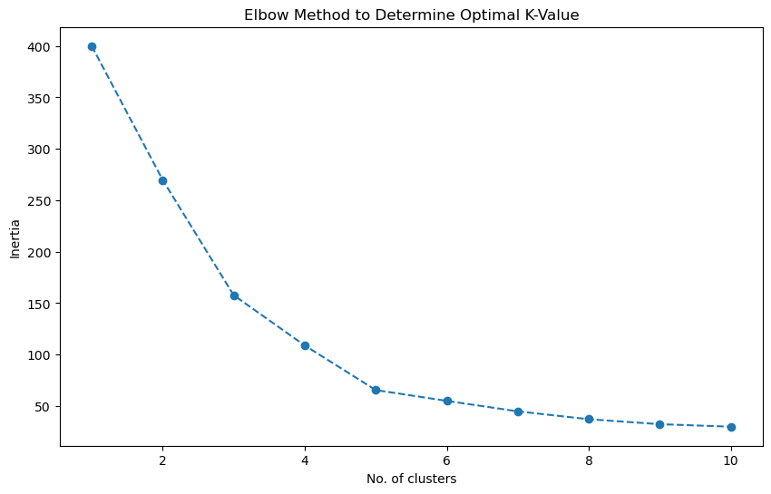
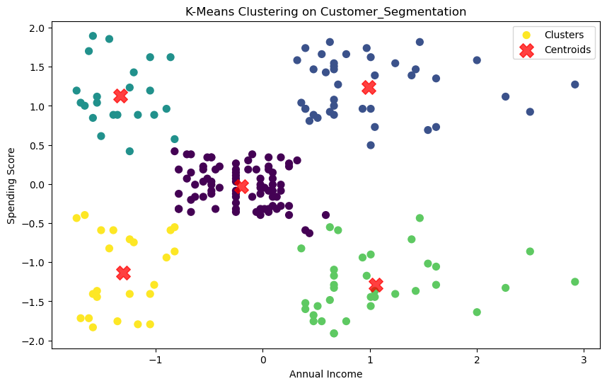
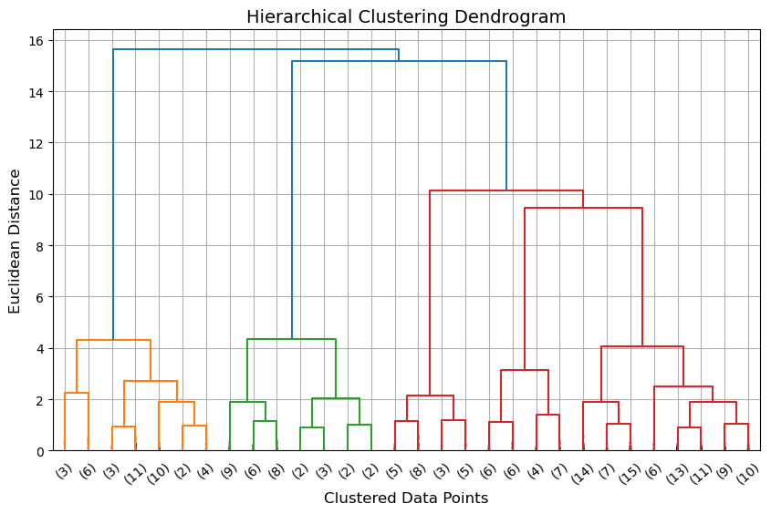
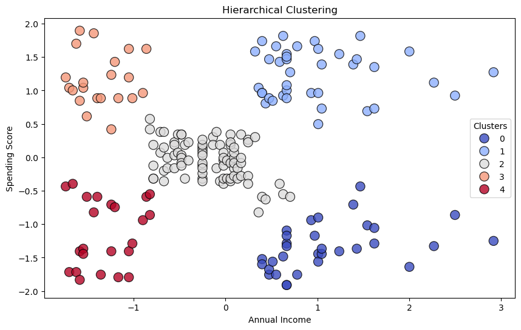

# Customer Segmentation using Machine Learning 🚀📊

Welcome to the **Customer Segmentation using Machine Learning** project! This initiative focuses on segmenting customers based on their purchasing behavior, using clustering techniques like **K-Means** and **Hierarchical Clustering**.

---

## 📝 Table of Contents

- [About the Project](#about-the-project)
- [Key Features](#key-features)
- [Dataset](#dataset)
- [Technologies Used](#technologies-used)
- [Getting Started](#getting-started)
- [Results](#results)
- [Output Visualizations](#output-visualizations)
- [Contributing](#contributing)
- [License](#license)

---

## About the Project 📚

The **Customer Segmentation** project applies machine learning techniques to cluster customers based on their **Annual Income** and **Spending Score**. Through this project, we aim to:

- Perform **data preprocessing** and scaling.
- Apply **K-Means Clustering** and determine the optimal **K** using the **Elbow Method**.
- Apply **Hierarchical Clustering** and analyze the **Dendrogram**.
- Visualize clusters to uncover meaningful **customer segments**.

---

## Key Features 🎯

- **Data Exploration**: Understand customer spending habits and income groups.
- **Visualization**: Interactive visualizations for better insights.
- **Machine Learning Models**: K-Means and Hierarchical Clustering for segmentation.
- **Business Insights**: Practical recommendations for marketing strategies.

---

## Dataset 📂

The dataset, **Mall_Customers.csv**, contains customer information such as:
- **Customer ID**
- **Age**
- **Gender**
- **Annual Income**
- **Spending Score**

---

## Technologies Used 🛠️

- **Programming Language**: Python
- **Libraries**: NumPy, Pandas, Matplotlib, Seaborn, Scikit-learn
- **Tools**: Jupyter Notebook

---

## Getting Started 🚀

### Prerequisites
- Python 3.8 or higher
- Required libraries installed (`pip install -r requirements.txt`)

## 🚀 Running the Code
1. Clone this repository:
   git clone https://github.com/QuantumCoderrr/Customer-Segmentation-ML.git

2. Install dependencies:
   pip install -r requirements.txt

3. Run the script:
   python src/clustering.py

## 📌 Results
Our analysis yielded the following insights:

Optimal Clusters: The Elbow Method determined the best number of clusters for segmentation.
Customer Segments: Clear groups of customers based on income and spending habits.
Model Evaluation: The clustering models successfully segmented customers for targeted marketing.

## 📸 Visualizations
**1. Elbow Method for KMeans**  

**2. K-Means Clustering**  

**3. Dendrogram for Hierarchical Clustering**  

**4. Hierarchical Clustering**  

### Contributing
We welcome contributions from everyone! To learn how you can contribute, please see our [Contributing Guidelines](CONTRIBUTING.md).

### Code of Conduct
Please note that we have a [Code of Conduct](CODE_OF_CONDUCT.md) in place to ensure that all participants can contribute in a respectful and welcoming environment.

### License 📜
This project is licensed under the MIT License. See the [LICENSE](LICENSE) file for details.
